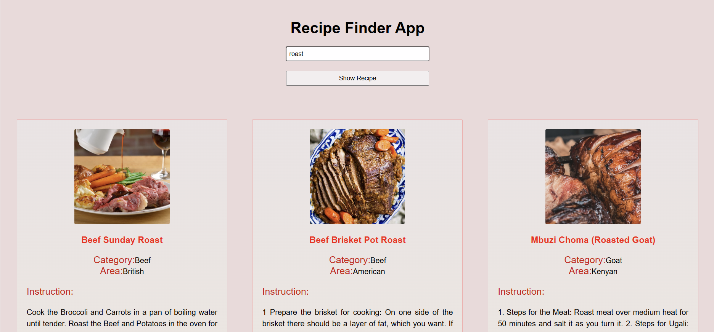

🍲 Recipe Finder App

A simple web application to search and explore recipes using the free TheMealDB API.

---

🚀 Features

🔍 Search recipes by name (e.g. Pizza, Pasta, Salad)

📸 Display recipe image, category, and origin

📑 Using flex for Responsible design

⚠️ Handles errors (no results, empty search)

---

🛠️ Technologies Used

HTML5 for structure

CSS3 for styling

JavaScript (ES6) for functionality

TheMealDB API for fetching recipes

---

📂 Project Structure

recipe-finder-app/
│── index.html     # Main HTML file
│── style.css      # Styling
│── code.js      # Functionality
│── README.md      # Project documentation

---

📸 Screenshot

📦 How to Run

1. Clone or download the repository

2. Open index.html in your browser

3. Type a recipe name and click Show Recipe

or click  https://raziyeh2025.github.io/recipe-finder-app/

---

🔮 Future Improvements

Add filter by category or country

Show ingredients list with measures

Add "favorite recipes" using local storage

---

👩‍💻 Author

Developed by raziyeh2025
